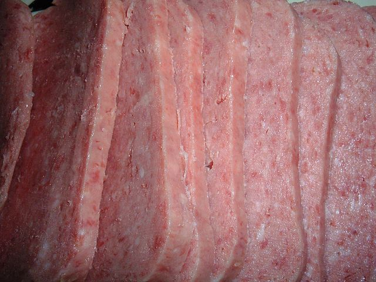
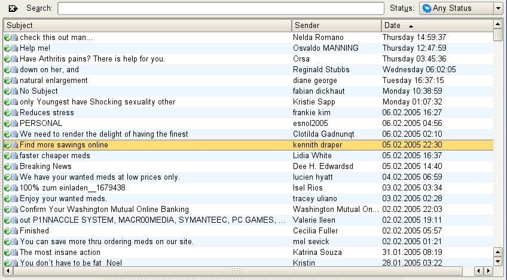
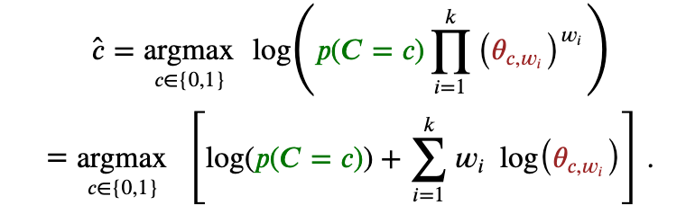

# Spam classifier

## Introduction

The goal of this work is to write an supervised learning-based classifier to determine whether a given email is spam or ham. Email spam, also referred to as junk email, is unsolicited messages sent in bulk by email (spamming). 

Originally the name spam referred to a brand of canned cooked pork made by Hormel Foods Corporation. The product was intended to increase the sale of pork shoulder which was not a very popular cut. [2]

 (Source: Wikipedia [2])

During the World War II Spam became a ubiquitous part of the U.S. soldier's diet. It became variously referred to as "ham that didn't pass its physical", "meatloaf without basic training", and "Special Army Meat". It was featured in an iconic 1970 Monty Python sketch called "Spam". Set in a café which mostly served dishes containing Spam, including "egg and Spam, egg bacon and Spam, Spam egg sausage and Spam, Spam egg Spam Spam bacon and Spam ",the piece also featured a companion song. [2] [3]


The legal definition and status of spam varies from one jurisdiction to another, but nowhere have laws and lawsuits been particularly successful in stemming spam. Most email spam messages are commercial in nature. Many are dangerous because they may contain links that lead to phishing web sites or sites that are hosting malware - or include malware as file attachments.(Source: Wikipedia [1])


 
Spammed-mail-folder.png Image:  (Source: Wikipedia [1])

## Anti-spam techniques

Due to the prevalence of spam there are many techniques used to fight it. No technique is a complete solution to the spam problem, and each has trade-offs between incorrectly rejecting legitimate email (false positives) as opposed to not rejecting all spam (false negatives) – and the associated costs in time, effort, and cost of wrongfully obstructing good mail. Anti-spam techniques can be broken into four broad categories: those that require actions by individuals, those that can be automated by email administrators, those that can be automated by email senders and those employed by researchers and law enforcement officials.[4]

## Statistical filtering and Naive Bayes

Naive Bayes classifiers are a popular statistical technique of e-mail filtering. They typically use bag of words features to identify spam e-mail, an approach commonly used in text classification.

Bayesian email filters utilize Bayes' theorem. Bayes' theorem is used several times in the context of spam:

* a first time, to compute the probability that the message is spam, knowing that a given word appears in this message;
* a second time, to compute the probability that the message is spam, taking into consideration all of its words (or a relevant subset of them);
* sometimes a third time, to deal with rare words. [5]

This benefit of Naive Bayes means that you can re-calculate the probabilities as the data changes. 

## Naive Bayes implementation

We’d like to predict whether a message is spam or ham. We can ask ourselves what is the probability that a certain message is spam if it contains certain words? If the probability that a message is spam is higher than the probability that the message is ham the message can be classified as spam. A message is represented as a set of 𝑘 keywords, where 𝑤𝑖=1 if the keyword appears in the message and 𝑤𝑖=0 otherwise. The set of keywords represents the vocabulary. First the prior probabilities are calculated by counting the number of spam messages and number of ham messages and dividing both numbers with the number of total messages. In the next step it is calculated for every keyword in the vocabulary, what is the probability that the keyword appears if this is a spam message and similarly for the ham message. When we have both probabilities calculated we can use the following formula to decide whether the message is spam or ham:

 
Source: [University of Bath, Foundations of AI](https://online.bath.ac.uk/online-courses/msc-artificial-intelligence)

### Laplace-smoothing 

Since the individual probabilities can be small numbers the product of those probabilities will be an even smaller number. To avoid loss of precision of the floating point values, such as under-runs, we can work in the log probability space and take the logarithm of the probabilities.

### Calculate prior probabilities

```python
    def estimate_log_class_priors(self, data):
        """
        What is the probability that any message is spam or ham?

        :param data: a two-dimensional numpy-array with shape = [n_samples, 1 + n_features]
                     the first column contains the binary response (coded as 0s and 1s).

        :return log_class_priors: a numpy array of length two
        """

        return np.array([np.log(data[data[:, 0] == 1].shape[0] / data.shape[0]),
                         np.log(data[data[:, 0] == 0].shape[0] / data.shape[0])])
```

### Calculate probability that a word i appears based on class spam / ham 

Here it is calculated for every keyword in the vocabulary, what is the probability that the keyword appears if this is a spam message and similarly for the ham message. Laplace-smoothing is used to avoid numerical problems with small numbers.

```python
        def estimate_log_class_conditional_likelihoods(self, data, alpha=1.0):
        """
        Calculate the probability that the word i appears depending on the class (spam / ham). Use Laplace-smoothing.  

        :param data: a two-dimensional numpy-array with shape = [n_samples, 1 + n_features]

        :return theta:
            a numpy array of shape = [2, n_features]. theta[j, i] corresponds to the
            logarithm of the probability of feature i appearing in a sample belonging
            to class j.
        """
        spam = data[data[:, 0] == 1]
        ham = data[data[:, 0] != 1]

        spam_total = spam.shape[0]
        ham_total = ham.shape[0]

        Nwspam = [spam[:, x].sum() for x in range(1, spam.shape[1])]
        Nwham = [ham[:, x].sum() for x in range(1, ham.shape[1])]
        Nspam = sum(Nwspam)
        Nham = sum(Nwham)
        
        spam_theta = [np.log((Nwspam[x] + alpha)/(Nspam + self.k*alpha)) for x in range(0, len(Nwspam))]
        ham_theta = [np.log((Nwham[x] + alpha) / (Nham + self.k*alpha)) for x in range(0, len(Nwham))]
        return np.array([spam_theta, ham_theta])
```

### Training the model

To train the model we simply load the training dataset and calculate the prior probabilities and the probabilities of individual keywords based on the class:

```python
    def train(self):        
        train_set = np.loadtxt(open("data/training_spam.csv"), delimiter=",").astype(np.int)
        self.log_priors =  self.estimate_log_class_priors(train_set)        
        self. log_class_cond_likelihoods = self.estimate_log_class_conditional_likelihoods(train_set)
```

### Using the model to classify new messages

To use the model call the predict method with the dataset containing the new messages. Each message will be classified with the correct class based on what probability is higher, probability that the message is spam or the probability that the message is ham:

```python
        def predict(self, new_data):
        pspam = new_data[:,:] * self.log_class_cond_likelihoods[0]
        pham = new_data[:,:] * self.log_class_cond_likelihoods[1]
        result = [1 if (self.log_priors[0] + sum(s)) > (self.log_priors[1] + sum(h)) else 0 for s, h in zip(pspam,pham)]

        return result
```

## Results

The results of the algorithm were tested on a set of test messages. Accuracy was calculated using the following formula:

```
𝐴𝑐𝑐𝑢𝑟𝑎𝑐𝑦 =  (𝑇𝑃+𝑇𝑁)/(𝑇𝑃+𝑇𝑁+𝐹𝑃+𝐹𝑁)
```
where:
* TP - true positive
* TN - true negative
* FP - false positive
* FN - false negative

Measuring the actual result of the test run the following results can be observed:

```
FP = 34
FN = 17
TP = 182
TN =  267
```

which gives the accuracy of 0.898 or 89.8% predictions were correct. 

## Summary and further improvements

Despite its simplicity and relative easy of implementation the Naive Bayes gives more than satisfying results. It could be further combined with the use of an ANN to use a hybrid spam classifier and achieve an even higher accuracy as desceribed in [Gbenga, Dadaa, Bassia, Haruna et al, 2019, ‘Machine learning for email spam filtering: review, approaches and open research problems’, ‘Science Direct’](https://www.sciencedirect.com/science/article/pii/S2405844018353404). The expected accuracy would however be only slightly improved over the baseline Multinomial Naive Bayes classifier. 

[1]: https://en.wikipedia.org/wiki/Email_spam
[2]: https://en.wikipedia.org/wiki/Spam_(food)
[3]: https://www.youtube.com/watch?v=zLih-WQwBSc
[4]: https://en.wikipedia.org/wiki/Anti-spam_techniques
[5]: https://en.wikipedia.org/wiki/Naive_Bayes_spam_filtering
